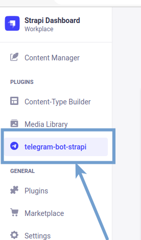
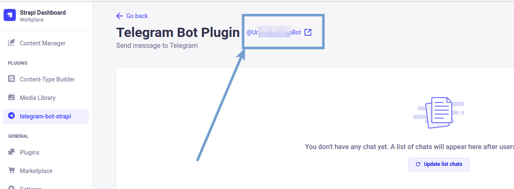
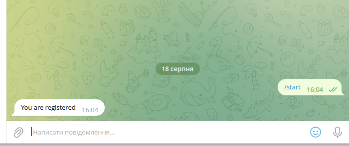
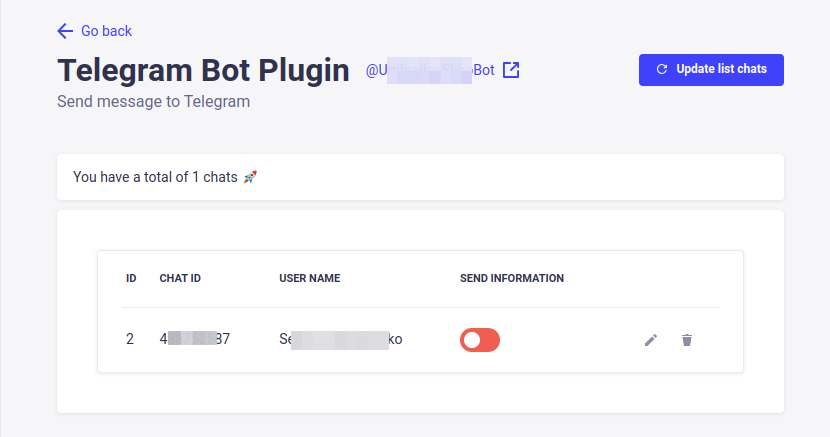
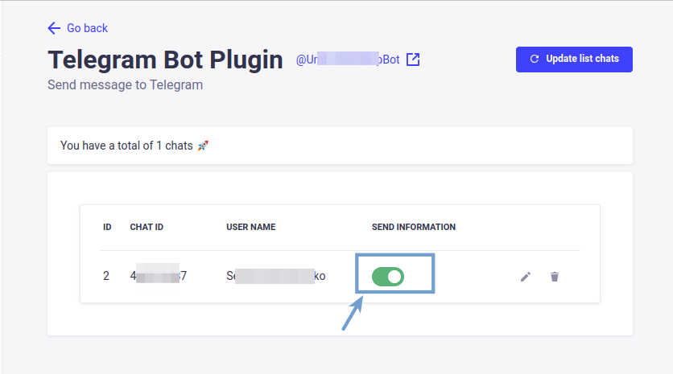

# Strapi v4 plugin: Telegram bot

Plugin Strapi for sending messages to a Telegram bot.

---

## Table of Contents

- [✨ Features](#✨-features)
- [⏳ Installation](#⏳-installation)
- [🔧 Configuration](#🔧-configuration)
- [🖐 Using](#🖐-using)
- [📚 References](#📚-references)

# ✨ Features

The plugin allows sending text messages to site administrators. This will enable quicker processing of customer inquiries or orders.

# ⏳ Installation

## Via Strapi Marketplace

Currently, this is not implemented.

## Via command line

(Use yarn to install this plugin within your Strapi project (recommended). [Install yarn with these docs.](https://yarnpkg.com/lang/en/docs/install/))

```
  yarn add telegram-bot-strapi
```

After successful installation you've to re-build your Strapi instance. To archive that simply use:

```
  yarn build
  yarn develop
```

The **telegram-bot** plugin should appear in the **Plugins** section of Strapi sidebar after you run app again.

As a next step you must configure your the plugin by the way you want to. See **Configuration** section.

All done. Enjoy 🎉

# 🔧 Configuration

- Register a Telegram bot using [@BotFather](https://t.me/BotFather)
- Add the received token to the .env file.
  ```
  TELEGRAM_TOKEN=""
  ```
- A plugin will appear in the Strapi admin panel.

  

- In the plugin window, the name of your bot should appear.
  
- Congratulations, everything is ready for use.

# 🖐 Using

- Add the created bot to the contacts list.
- Execute the command `/start` in the added bot.
  
- Receive a message about successful registration.
  
- In the bot's window, click the `Update list chats` button.
- The registered user will appear in this list.
  
- Edit the user's settings to allow them to receive messages.
  
- To send messages to all selected users, make a `POST` request.

  ```
  http://[addres sever]/telegram-bot-strapi/send-message

    {
      "message": "My first message"
    }
  ```

- All activated users will receive the message.
- In response, we will receive a message:

  ```
  {
    "result": "Message send"
  }
  ```

# 📚 References

- [Strapi](https://strapi.io)
- [Create Telegram bot](https://flowxo.com/how-to-create-a-bot-for-telegram-short-and-simple-guide-for-beginners/)
- [Create Telegram bot (Video)](https://youtu.be/XoryoE9V88E)
